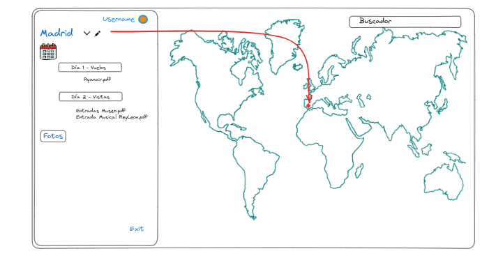

# Diario-de-a-bordo---ProyectoFinal
## Definicion del cliente

#### Página de registro y inicio de sesión: 
Los usuarios pueden crear una cuenta personal utilizando una página de registro y luego iniciar sesión utilizando sus credenciales de acceso.

La pagina inicial será la de registro, con un botón para acceder directamente al login si el usuario ya está logado. Al igual que en la pagina de login debe haber un boton para acceder al registro. 

Una vez logado, el usuario debe ser redirigido a la pagina principal, que debe contener los siguientes campos:

#### Mapa interactivo:
Los usuarios pueden visualizar un mapa interactivo donde podrán marcar los lugares que planean visitar durante su viaje. 
Debe haber un buscador de ciudades que permita marcarlas. 

#### Gestión de itinerarios:
Los usuarios pueden programar actividades diarias durante su viaje marcando la fecha del viaje y creando carpetas por día, estableciendo la hora, duración y adjuntando documentación necesaaria de las distintas actividades.

Para lo anterior, cuando el usuario eliga un lugar en el mapa, se debe abrir una carpeta a la izquierda con un calendario para marcar la fecha del viaje. 

Dentro de esta el usuario puede crear carpetas por dia de viaje, en la que puede adjuntar toda la documentacion necesaria y las fotos del día. 
```
{
  Ejemplo : 
  Londres - 15/09/2023 - 22/09/2023
    Día 1
      Vuelo ida
      Checking Hotel
      Bono transporte privado Aeropuerto - Hotel
    Día 2
      Entradas 
      Reserva Restaurante
}
```

#### Gestión de fotos:
Los usuarios pueden agregar fotos a medida que realizan actividades durante su viaje por día, que se quedarán archivadas en cada carpeta. 


   
   


## Definición Técnica
### BACKEND


#### Alta de usuarios:

- Necesitamos una tabla de "users" en la que se vayan cargando los datos de los usuarios.
  ```
   {
    id, (uuid v4, PRIMARYKEY),
    Email, (TEXT NOT NULL Y UNIQUE),
    Username, (TEXT NOT NULL Y UNIQUE),
    Password , (TEXT NOT NULL Y UNIQUE)
  }
  ```
 

- Rutas para el registro, login y consulta de usuarios --> /auth
  - POST : /signup -> Aquí debe encriptarse la contraseña utilizando la libreria "simple-stateless-auth-library"
  - POST : /signin
  - POST : /signout 

#### Mapa interactivo
 - Integrar libreria leaflet
 - Utilizar plugin de control de busqueda de la propia libreria
 - Utilizar plugin de marcadores de la propia libreria
 - Ajustar zoom para visualizar el mapamundi completo por paises
 - Tabla Country para  volcar los datos del país marcado por el usuario :

  ```{
    id, (uuid v4, PRIMARYKEY)
    name_country, TEXT NOT NULL
    lat_lmg (TEXT NOT NULL) ->(Este dato viene proporcionado por el     front con el evento click y con el plugin de marcador de la misma libreria)
    id_user, (uuid v4, REFERENCE (users))
  }
  ```
  

- Rutas para introducir los datos en la tabla anterior:

  - Para recoger los datos que proporcionan tanto el plugin de click o el de marcador de la libreria,
    const latlng : "datos recogidos del front"

    POST : /country 
    ```
      Body 
      {
        "id_user"
        "name_country"
        "lat_lng"
      }
    ```
#### Gestion de itinerarios y actividades

- Tabla activities:

```
{
  "id": (uuid v4, PRIMARY KEY),
  "name_activity": TEXT NOT NULL,
  "date_activity":TEXT NOT NULL,
  "id_country": (uuid v4, REFERENCE (country))
}
```

- Ruta para añadir las actividades a la tabla anterior, 

  - El usuario añadirá manualmente las actividades que realizará y su fecha, para eso tendrá 2 campos a cumplimentar en el front:
    - Descripción
    - Fecha (Calendario)

  Esto pasará a la tabla Activities con una consulta POST

POST : /Country/activities 
```
body
  {
    "id_country" 
    "description" : 
    "date":
  }
  ```

#### Gestion de fotos
- Tabla imgs :
```
{
id: (uuid v4, PRIMARY KEY)
id_username :(uuid v4 , REFERENCE (users)),
id_country :( uuid v4 , REFERENCE (country)),
img : (URL Cloudinary)
}
``` 
- Utilizar Cloudinary para almacenar las imágenes,
- Relacionar las imagenes con el id del usuario y del país visitado,
- Estas fotos se verán almacenadas en una carpeta de cada país. 
- Rutas para consultas POST y GET a base de datos:

POST/country/img :
```
Body
 {
  id_username 
  id_country
  url: "url cloudinary"
 }
 ```

GET/country/img : Visualizacion de todas las fotos del usuario en el front. 

### FRONTEND

#### Usuarios
- Register (Sin proteger, pero si estamos logados, nos redirigirá al Panel), contendrá :
  - Campo email (requerido)
  - Campo username (requerido)
  - Campo password (requerido, longitud mínima de 4 caracteres)
  - Campo submit (si todo va bien, redirigir a Login)

- Login (Sin proteger, pero si estamos logados, nos redirigirá al Panel)
  - Título h1 "Login"
  - Campo email (requerido)
  - Campo password (requerido, longitud mínima de 4 caracteres)
  - Campo submit (si todo va bien, redirigir a Panel)

- Panel (Protegida, si no estamos logados, nos redirigirá al Login), contendrá:

  - Mapa interactivo, con barra buscadora y botón para crear marcadores

  - Sidebar en el que se encontrará los datos del usuario 
    - Nombre en negrita
    - Botón para salir de la app

    - Países marcados por el usuario,
     - Calendario para marcar la fecha del viaje dentro de un input justo al lado del nombre del país visitado. 
     - Input para adjuntar fotos.

Y dentro de la carpeta del país podrá crear el propio usuario datos de las actividades con los siguientes campos :

       - Input para nombrar la actividad
       - Calendario para marcar la fecha de la actividad
       - Campo para guardar la documentacion de la actividad.

** Extra : Añadir avisos por email de cada actividad
** Carrusel de imagenes en los marcadores. 