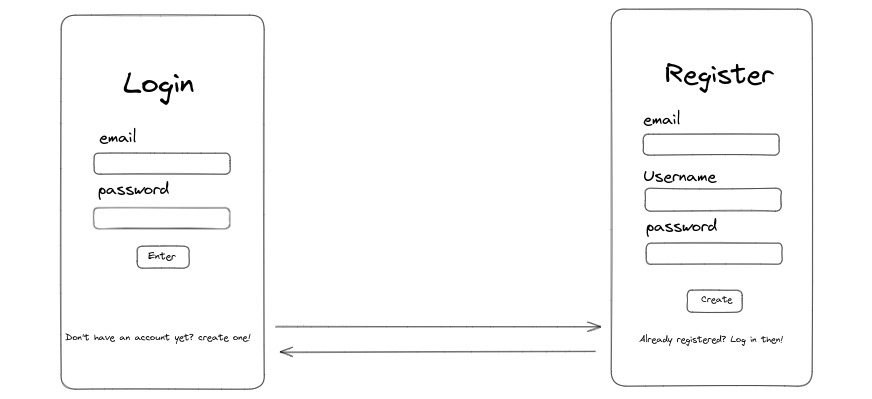
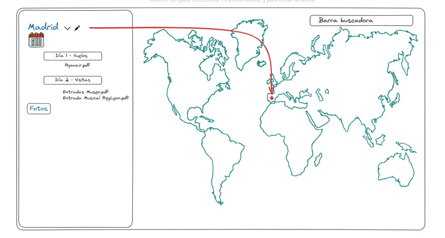

# Diario-de-a-bordo---ProyectoFinal
## Definicion del cliente

#### Página de registro y inicio de sesión: 
Los usuarios pueden crear una cuenta personal utilizando una página de registro y luego iniciar sesión utilizando sus credenciales de acceso.

La pagina inicial será la de registro, con un botón para acceder directamente al login si el usuario ya está logado. Al igual que en la pagina de login debe haber un boton para acceder al registro. 

Una vez logado, el usuario debe ser redirigido a la pagina principa, que debe contener los siguientes campos:

#### Mapa interactivo:
Los usuarios pueden visualizar un mapa interactivo donde podrán marcar los lugares que planean visitar durante su viaje. 
Debe haber un buscador de ciudades que permita marcarlas. 

#### Gestión de itinerarios:
Los usuarios pueden programar actividades diarias durante su viaje marcando la fecha del viaje y creando carpetas por día, estableciendo la hora, duración y adjuntando documentación necesaaria de las distintas actividades.

Para lo anterior, cuando el usuario eliga un lugar en el mapa, se debe abrir una carpeta a la izquierda con un calendario para marcar la fecha del viaje. 

Dentro de esta el usuario puede crear carpetas por dia de viaje, en la que puede adjuntar toda la documentacion necesaria y las fotos del día. 
Ejemplo : 
  Londres - 15/09/2023 - 22/09/2023
    Día 1
      Vuelo ida
      Checking Hotel
      Bono transporte privado Aeropuerto - Hotel
    Día 2
      Entradas 
      Reserva Restaurante

#### Gestión de fotos:
Los usuarios pueden agregar fotos a medida que realizan actividades durante su viaje por día, que se quedarán archivadas en cada carpeta. 

**Extra:
- La aplicación enviará recordatorios automáticos para cada actividad.
- Las fotos se organizan por día y al finalizar el viaje se genera un carrusel de fotos que muestra todas las imágenes capturadas.

   
   

      